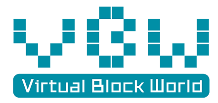

Details:	[English edition](bluemap/EN.md) 	[Chinese edition](bluemap/CN.md)

"Virtual Block World(VBW)" is a virtual world composed of blocks. The data on each piece of land is rendered into a 3D environment, and these data are properly stored in the private chain dedicated to the VBW. These credible data can replace pictures and words, transmit valuable content, and become a new way of communication.

# Now

* Editing blue map
* Applying for grants program of W3F
* Preparing to code module trigger and module gift
* Preparing to code module tree
* Coding resource Chord

## Demos

* Demo based on Substrate/Polkadot is update to this repository [VirtualBlockWorld](https://github.com/ff13dfly/VirtualBlockWorld).

* Demo based on PHP is online, you can access as follow:
  * frontend : http://vbw.qqpi.net/web/
  * control panel : http://vbw.qqpi.net/admin/  (user: admin; password: admin123456)

