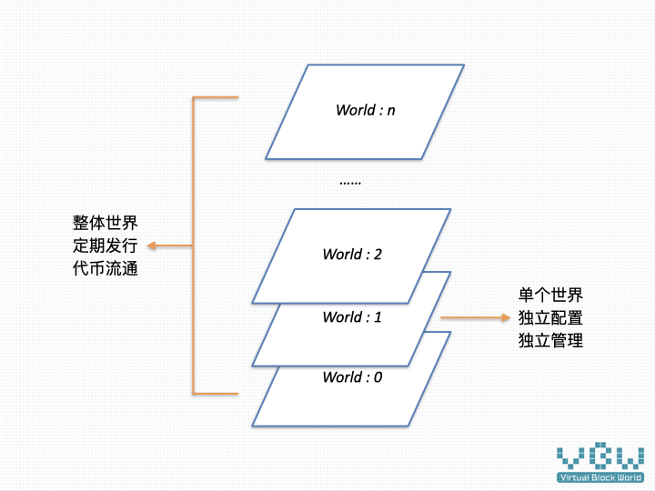
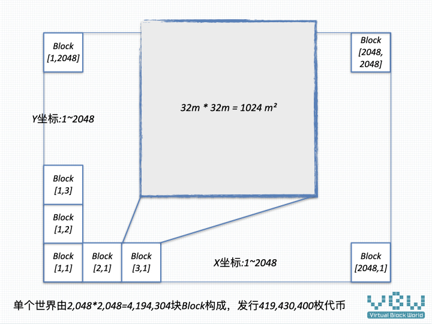
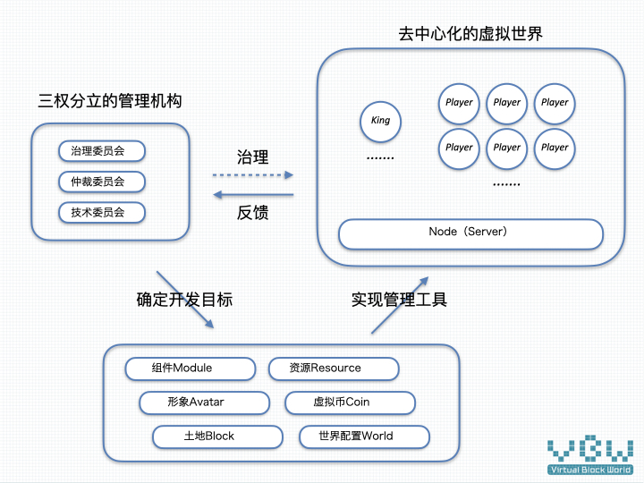
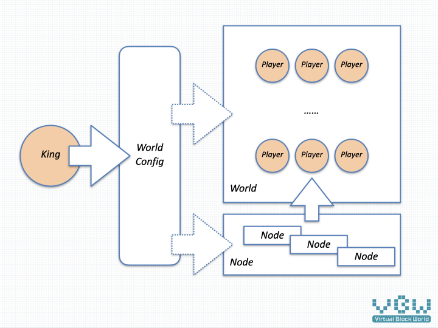

# 虚块世界（Virtual Block World）

虚块世界是一个由土地（Block）构成的虚拟世界，每块土地上的数据渲染成3D环境，这些数据都妥善的保存在虚块世界专用的私链上。这些可信的数据，可以替代图片和文字，传递有价值的内容，成为一种新的交流方式。

## Why

随着信息技术的发展，几项极具革命意思的产品出现在我们面前，他们是区块链、AR/VR、高速互联网、AI、机器人技术，每个技术都预示着生产力的极大进步，社会关系也会随之慢慢变化，最终将世界推向何方，是个令人兴奋的话题。

虚拟世界也许就是其中的一个必然，我们认为原因如下：

* 随着AI和机器人技术的发展，生产力提高之后，必然会闲置大量人力。这一趋势已经漏出了苗头，人们在娱乐上花费的时间越来越多，大部分工作的时间越来越短。这么多无处安放的聪慧头脑，未来几十年，是人类面临的一个重要问题。

* 比特币的逆袭，让区块链技术脱颖而出，成为可信数据最有力的竞争者，应该也是胜出者。同时，去中心化的治理模式，经历了时间的考验，从技术领域渐渐外溢到日常生活领域，会越发为人所知。在对区块链技术应用的探索中，“数字资产”呼之欲出。

* AR/VR技术，这种新的显示技术，将重构现有的信息交流方式，文字、音频、视频将会在3D的环境里重新寻找合适的呈现方式，而虚拟形象和3D环境本身，也会成为一种新的表达方式，有极大的机会成为新生代的娱乐平台，进而成为生产力平台，就像很多科幻电影构架的未来世界一样。

  

## How

信息技术的核心还是数据和算法，同样适用于虚拟世界的开发。虚块世界落地推进的2020年，和虚块世界直接相关的几项技术，处于什么样的阶段呢？

* AR/VR技术还在静静地沉淀等待突破，沉浸式的虚拟世界还需时日。

* 区块链技术日趋成熟，尤其是substrate提供了高效的开发框架，很方便的用区块链的方式来存储数据。

* 手机是当前终端的主流平台，3D能力突飞猛进，有很多制作精良的游戏

  

因此，虚块世界将采取 “先数据，后硬件” 的策略，先在手机平台上运行虚拟世界，静待AR/VR技术发展，能够快速的衔接到未来最新沉浸式的虚拟世界。通过以下几种技术手段，让数据能从今天的手机平台走到未来的AR/VR平台。

* 跨平台数据，定义便于跨平台的3D数据格式，即使在手机平台上也能实现多游戏引擎的支持，未来的AR/VR平台也不在话下。

* 开放治理，区块链技术提供了强有力的去中心化能力，虚块世界将建立三权分立的管理结构，通过可更新的分配机制，来满足玩家、矿机等多方的需求，让数据安全保存。

* 土地私有，保障玩家所有权，在虚块世界中逐步形成自洽的循环系统，让用户能自由创建丰富多彩的虚拟世界

  

## What

虚块世界由逐月发行的相对独立的世界构成，每个世界由2048 x 2048块土地构成，每块土地的尺寸为32m x 32m的方块，每块土地对应发行100枚VBC(Virtual Block Coin)，共发行419,430,400枚 ( 100x2048x2048 ) VBC，用于土地买卖、物品买卖、支付服务器费用等。

单个世界的构成，如下图所示：

虚块世界的3D显示效果，如下图所示：

整个虚块世界的治理关系，如下图所示：

单个世界的治理关系，如下图所示：

### 虚块世界治理

虚块世界，借鉴三权分立的原则，通过以下三个组织来实现去中心化管理。

* 治理委员会（立法），管理虚块世界的发行，虚块世界的发展规划等。
* 仲裁委员会（司法），处理运营中出现的问题，解决玩家争端等。
* 技术委员会（执法），虚块世界的代码实现，自动执行确定的规则。

虚块世界将用3年的时间，来实现从个人治理到去中心化治理，共经历3个阶段：创始人治理、否决权治理、去中心化治理。相对应的是技术开发的推进，测试网络的实现，最终，交给玩家一个开放的、丰富多彩的虚拟世界。

理想的状态是，新世界发行的收入用于支付三个委员会的费用。治理委员会和仲裁委员会为管理费用，技术委员会为管理费用和开发费用，形成良性循环，构建自洽的生态系统。

### 虚块世界运营

* [世界发行](cn/publish.md)，虚块世界按月发行新世界及对应的代币，经历为期3个月的上线流程后，即成为可以公开访问的世界。

* [King说明](cn/king.md)，单个世界的最高管理者为King，通过修改世界的参数配置，来塑造和管理不同的世界。

* [节点说明](cn/node.md)，节点和区块链去中心化的节点功能类似，增加了独立的缓存节点模式，用于提高虚块世界的渲染速度。

### 虚块世界功能组成

* [土地Block](cn/block.md)，虚块世界的构成基础，每块的大小为32m*32m，由坐标[X,Y]进行定位。
* [资源Resource](cn/resource.md)，主要为用于保存外部3D文件、图像等较大尺寸的文件。
* [代币Coin](cn/coin.md)，在整个虚块世界流通的VBC，解决流通、支付的问题。
* [世界管理World](cn/world.md)，对世界参数进行调整的功能模块。
* [组件Module](cn/module.md)， 功能组织的最小单元，基于substrate来实现。
* [形象Avatar](cn/avatar.md)，虚拟世界用户形象管理模块。

虚块世界的开发是个长期动态的过程，将逐步实现自洽，将管理功能也存储到链上。

### 其他说明

* 虚块世界的时间，时间轴采用链的区块号，调整到为现实世界30倍的时间。
* 虚块世界的账户，使用substrate的账号系统。

