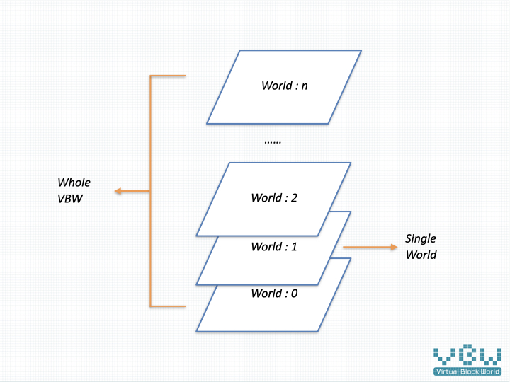

# Virutual Block World

"Virtual Block World(VBW)" is a virtual world composed of blocks. The data on each piece of land is rendered into a 3D environment, and these data are properly stored in the private chain dedicated to the VBW. These credible data can replace pictures and words, transmit valuable content, and become a new way of communication.

## Why

With the development of information technology, several revolutionary products have appeared in front of us. They are blockchain, AR / VR, high-speed Internet, AI and robotics. Each technology indicates great progress in productivity, and social relations will change followed. How technology  will push the world , It is an exciting topic.

"Virtual World" may be one of the inevitable reasons:

* With the development of AI and robot technology, a lot of manpower will be idle after the productivity is improved. This trend has leaked out, people are spending more and more time on entertainment, and most of their working hours are getting shorter and shorter. There are so many intelligent minds that have no place to be placed, which will be an important problem for human beings in the coming decades.

* Bitcoin's counter attack has made blockchain technology stand out and become the most powerful competitor and winner of trusted data. At the same time, DAO(Decentralized Autonomous Organization) gradually spills over from the technology field to the daily life field, and will be know well. As the development of blockchain technology, "digital assets" is ready to emerge.

* AR / VR technology, this new display technology, will reconstruct the existing way of information exchange. Text, audio and video will find suitable presentation methods in 3D environment. Virtual image and 3D environment itself will also become a new way of expression, which has a great opportunity to become a new generation of entertainment platform, and then become a productivity platform, just like the framework of many science fiction movies.

  

## How

The core of information technology is data and algorithm, which is also suitable for the development of virtual world. In 2020, when the VBW is launched, what is the stage of several technologies directly related to the virtual block world?

* AR / VR technology is still quietly precipitation waiting for a breakthrough, immersive virtual world will take time.

* Blockchain technology is becoming more and more mature, especially Substrate provides an efficient development framework, which is very convenient to store data in the way of blockchain.

* Mobile phone is the mainstream platform of the current terminal, 3D ability is advancing by leaps and bounds, there are many well-made games.

  

Therefore, VBW will adopt the strategy of "data first, glass after".VBW will be run on the mobile phone platform, waiting for the development of AR / VR technology. Through the following technical means, the data can be easily migrated from today's mobile phone platform to the future AR / VR platform.

* Cross platform data, define a convenient cross platform 3D data format, even on the mobile phone platform can realize the support of multiple game engines, and the future AR / VR platform is no exception.

* Open governance, blockchain technology provides a strong ability to decentralize. VBW will establish a management structure of separation of powers, and meet the needs of players, miners and other parties through renewable allocation mechanism, so as to ensure the safe storage of data.

* Private land ensures the ownership of players, and gradually forms a self consistent circulation system in VBW, so that users can freely create a rich and colorful virtual world for themselves.

  

## What

VBW is composed of relatively independent world which is publish monthly. Each world consists of 2048 x 2048 pieces of land(called Block). The size of each block is 32m x 32m. Each block corresponds to the issuance of 100 VBC (virtual block coin). A total of 419430400VBC(100x2048x2048) are issued, which are used for land sales, goods sales and payment of server fees.

The composition of a single world is shown in the following figure:

The 3D display effect of VBW is shown in the following figure:

The governance relationship of the whole VBW is shown in the following figure:

The governance of the single VBW world is shown in the following figure:

### Governance of VBW

VBW, drawing on the principle of separation of powers, realizes decentralized management through the following three organizations.

* Governance Committee : management of distribution, development planning , the roadmap of VBW.
* Arbitration Committee : dealing with the problems in the operation and solve the disputes among players.
* Technical Committee : coding or subcontracting  implementation of VBW, automatic execution of certain rules.

VBW will take three years to realize the transition from individual governance to decentralized governance, which will go through three stages: Founder governance, Veto governance and Decentralization governance. The corresponding is the promotion of technology development, the realization of test network, and finally, give the players an open and colorful virtual world.

Ideally, the proceeds from the new VBW world publish would be used to pay for the three committees. The Governance Committee and Arbitration Committee needs the management costs, and the Technical Committee needs the management costs and development costs, forming a virtuous circle and building a self consistent ecosystem.

### Operating of VBW

* [World Publish](en/publish.md) : VBW issues new world and its corresponding token on a monthly basis. After a three-month online process, it becomes a publicly accessible VBW world.
* [King](en/king.md) : the top manager of a single world, shapes and manages  world by modifying the parameters of the VBW world.
* [Node](en/node.md) : similar with blockchain decentralized nodes, and independent cache node mode will be added to improve the rendering speed of VBW.

### Functions of VBW

* [Block](en/block.md) : basic component of VBW , each block is 32m * 32m in size and located by coordinates [x, y].
* [Resource](en/resource.md) : saving external 3D files, images and other large-size files.
* [Coin](en/coin.md) : circulating in the whole VBW, solving the problems of circulation and payment.
* [World-setting](en/world.md) : adjusting target VBW world parameters.
* [Module](en/module.md) : the smallest unit of functional organization , basing on Substrate/Polkadot.
* [Avatar](en/avatar.md) : player avatar management module.

The development of VBW is a long-term dynamic process, which will gradually realize self consistency and store management functions in the chain.

### More of VBW

* The time and time axis of the VBW is adjusted to the 30 times of the real world by the block number of the private chain.
* VBW use the account system of substrate.

