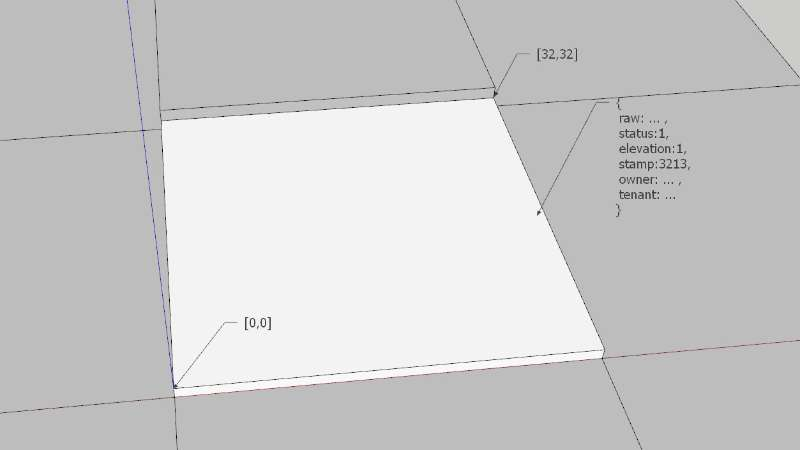

# 虚块世界土地（Block）说明

构成虚块世界的基础组件，默认尺寸为32m*32m，以坐标形式[X,Y]表示在世界中的位置。这样对于数字资产的管理带来很大的便利性，每块土地上的3D组件可以很便捷的拷贝到其他地块，数据内容不需要做任何改变。

下图所示为土地（Block）的示意：




## 土地的内容

土地上的内容，完整的保存在substrate创建的链上，涉及到的资源部分，进行同步，这样，就将整个虚拟世界完整的保存在了链上，这些内容被称为“数字资产”，可以是一个精心设计的场景，也可以是一个有趣好玩的小游戏。

数据结构如下：

```
{
	raw: 				Vec<u8>,   			//模块处理数据，3D空间呈现的数据都放置在这里
	status: 		u32,						//土地状态
	elevation: 	u32, 						//土地海拔高度
	stamp: 			BlockNumber,    //土地最新更新的区块号
	owner: 			UserID,       	//土地所有者
	tenant: 		UserID,     	 	//土地租赁者
}
```


## 土地的获取

* 世界拍卖的方式，King获取整个世界的土地所有权。
* 购买的方式，用户之间通过购买的方式进行土地交易。
* 拾取的方式，处于废弃状态的土地，可以直接拥有。


## 土地的状态

| 状态                    | 值   | 数据类型 | 说明                             |
| ----------------------- | ---- | -------- | -------------------------------- |
| BLOCK_STATUS_OK         | 1    | u32      | 正常访问状态                     |
| BLOCK_STATUS_PRIVATE    | 2    | u32      | 私有状态，仅所有者可以访问       |
| BLOCK_STATUS_GIFT_CHECK | 3    | u32      | 礼物检测，检测对应的Gift才能访问 |
| BLOCK_STATUS_ABANDON    | 4    | u32      | 废弃状态，可以被任何人重新占有   |
| BLOCK_STATUS_SELLING    | 5    | u32      | 出售状态，可以被交易             |
| BLOCK_STATUS_RENTING    | 6    | u32      | 租赁状态，可以被租赁             |

