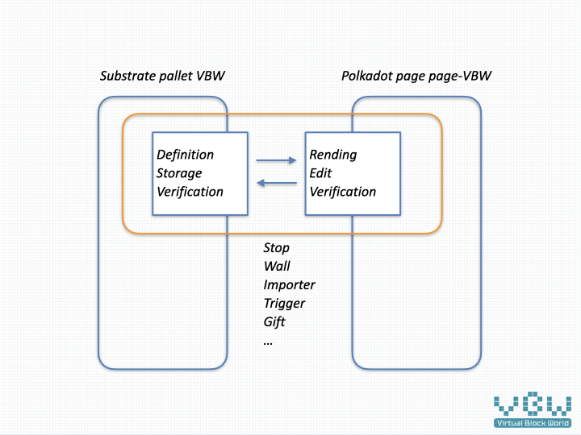

# 虚块世界组件（Module）说明

组件（Module）用于实现Block下raw节点数据的增删改查功能，相对独立的程序模块。


例如，以下节点数据，通过组件解释执行后，将显示为一座

```
{
	"wall":[
		[],
		[]
	],
	"stop":[
		[],
		[]
	],
}
```

前端渲染的结果如下：


## 组件目标

* 开放的定义，组件的数据结构定义将进行统一管理，开放透明。这样，可以便捷的扩展到多端开发。

* 安全可信的存储，使用substrate赋予的区块链能力，将整个3D场景的数据都存储在网络上。不同于简单的数值，这些数据能够构成可以进入体验的3D空间，形成有逻辑串联的游戏，结合虚块币VBC，形成自洽的虚拟3D世界。这就让数据本身有了脱离现实世界的价值，成为真正意义上的虚拟资产。

* 多端解析，通过不同的方式对数据进行构建，数据能够跨越平台进行展示。目前，可以很好的运行在PC平台、手机平台，待VR/AR成熟时，可以低成本的迁移过去。

* 基于区块链特性的探索，由于区块自带时间属性，如何让数据和时间发生联系并最终体现在3D环境里，是值得去尝试的。

  

## 组件构成

组件通过substrate端的验证、存储，Polkadot端的验证、解析、显示。




以stop组件（用于阻拦玩家前进的组件）为例，形成一个矩形围挡。

```
[
	[],
	[],
	[],
	[]
]
```

其在substrate端保存的状态为：

在前端显示的状态为：

横跨前后端的stop组件，实现了游戏中出现的阻挡功能。


## 组件分类

* 基础组件：[block](block.md)，[stop](stop.md)，[trigger](trigger.md)，[gift](gift.md)
* 扩展组件：[wall](wall.md)，[importer](importer.md)，[tree](tree.md)

