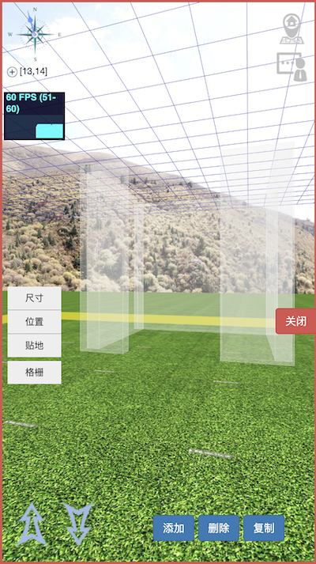

# 虚块世界组件（Module）说明

组件（Module）用于实现Block下raw节点数据的增删改查功能，相对独立的程序模块。


例如，以下节点数据，通过组件解释执行后，显示为一个矩形空间，仅从开口处可以进入。

```
{
	"wall":[
		[[4.3,0.2,3],[7.15,14.65,1.5],[0,0,0],2,[]],
		[[0.2,3,3],[9.15,13,1.5],[0,0,0],2,[]],
		[[0.2,3,3],[5.15,13,1.5],[0,0,0],2,[]],
		[[1,0.2,3],[8.65,11.35,1.5],[0,0,0],2,[]],
		[[1,0.2,3],[5.5,11.35,1.5],[0,0,0],2,[]]
	],
	"stop":[
		[[[0.3,3,4],[5.15,13,2],[0,0,0],1],
		[[4.3,0.3,4],[7.15,14.65,2],[0,0,0],1],
		[[0.3,3,4],[9.15,13,2],	[0,0,0],1],
		[[1,0.3,4],[5.5,11.35,2],[0,0,0],1],
		[[1.3,0.3,4],[8.65,11.35,2],[0,0,0],1]]
	],
}
```

[Demo演示(仅支持手机模式,坐标[5,6])](http://vbw.qqpi.net/web/index.html#5_6_0) , [后台图像编辑模式(账号:admin,密码:admin123456)](http://vbw.qqpi.net/admin/?mod=block&act=edit&x=5&y=6)

前端渲染的结果如下:


## 组件目标

* 开放的定义，组件的数据结构定义将进行统一管理，开放透明。这样，可以便捷的扩展到多端开发。

* 安全可信的存储，使用substrate赋予的区块链能力，将整个3D场景的数据都存储在网络上。不同于简单的数值，这些数据能够构成可以进入体验的3D空间，形成有逻辑串联的游戏，结合虚块币VBC，形成自洽的虚拟3D世界。这就让数据本身有了脱离现实世界的价值，成为真正意义上的虚拟资产。

* 多端解析，通过不同的方式对数据进行构建，数据能够跨越平台进行展示。目前，可以很好的运行在PC平台、手机平台，待VR/AR成熟时，可以低成本的迁移过去。

* 基于区块链特性的探索，由于区块自带时间属性，如何让数据和时间发生联系并最终体现在3D环境里，是值得去尝试的。

  

## 组件构成

组件通过substrate端的验证、存储，Polkadot端的验证、解析、显示。


以stop组件（用于阻拦玩家前进的组件）为例，形成一个矩形围挡，数据如下：

```
[
	[[[0.3,3,4],[5.15,13,2],[0,0,0],1],
	[[4.3,0.3,4],[7.15,14.65,2],[0,0,0],1],
	[[0.3,3,4],[9.15,13,2],	[0,0,0],1],
	[[1,0.3,4],[5.5,11.35,2],[0,0,0],1],
	[[1.3,0.3,4],[8.65,11.35,2],[0,0,0],1]]
]
```

保存在substrate端的数据为:

```
{
raw:0x7b2273746f70223a5b5b5b5b302e332c332c345d2c5b352e31352c31332c325d2c5b302c302c305d2c315d2c5b5b342e332c302e332c345d2c5b372e31352c31342e36352c325d2c5b302c302c305d2c315d2c5b5b302e332c332c345d2c5b392e31352c31332c325d2c5b302c302c305d2c315d2c5b5b312c302e332c345d2c5b352e352c31312e33352c325d2c5b302c302c305d2c315d2c5b5b312e332c302e332c345d2c5b382e36352c31312e33352c325d2c5b302c302c305d2c315d5d5d7d,
	status: 		1,
	elevation: 	0,
	stamp: 			42,
	owner: 			14iFLQgsUyWfCug92ir5Bd4kZVNH5u9FCdbnRhbQEnGYWhZB,
	tenant: 		14iFLQgsUyWfCug92ir5Bd4kZVNH5u9FCdbnRhbQEnGYWhZB,
}
```

[stop组件演示(仅支持手机模式,坐标[13,14])](http://vbw.qqpi.net/web/index.html#13_14_0),[后台图像编辑模式(账号:admin,密码:admin123456)](http://vbw.qqpi.net/admin/?mod=block&act=edit&x=13&y=14)

前端显示如下（仅在编辑状态下显示）：



## 组件种类

组件是构成虚块世界的重要组成部分，保障可以构建丰富多彩的虚拟世界，以下这些可以构建基本的3D环境。

* 基础组件：[block](block.md)，[stop](stop.md)，[trigger](trigger.md)，[gift](gift.md)
* 扩展组件：[wall](wall.md)，[importer](importer.md)，[tree](tree.md)，[chord](chord.md)

