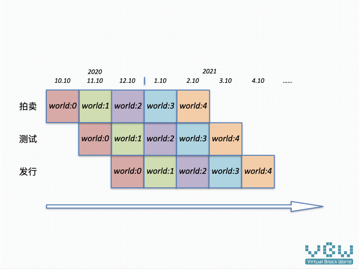

# 虚块世界发行说明

虚块世界采用按月发行模式，完整的上线流程为2个月，1个月的拍卖，1个月的测试上线。这是一种方便管理的发行方式，初期需要人员干预，待系统成熟稳定之后，可以预见，完全自动化是可以实现的，这很区块链，是去中心化的管理方式。

## 发行流程

### 拍卖

虚块世界按月发行，采用拍卖的方式进行，使用DOT进行支付。

### 测试

拍卖结束后，虚块世界的基本配置将写到链上，所有Block的所有者为King。King通过配置世界参数来塑造世界的发展方向，参数主要调节世界的以下几个方面。随着虚块世界的发展，具体配置内容会出现增加或限制，将由治理委员会进行统一的管理。[配置详情]()

* 各种费用比例

* 世界加载的模块

* 运营措施的配置

  

测试阶段另外一个重要方面，是对新世界进行建设。世界的运营依赖King的聪明才智，创造有趣新颖的世界，才能吸引到玩家，让世界的土地升值，更多的玩家贡献有趣的内容。

### 上线

虚块世界测试阶段结束之后，正式对玩家开放。

## 发行计划

虚块世界自2020年10月开始0号世界的发行

## 

虚块世界

