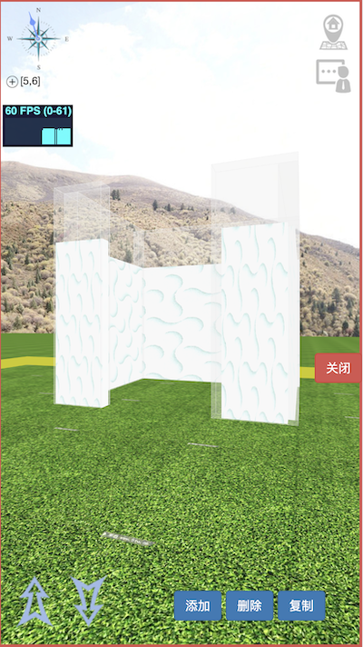
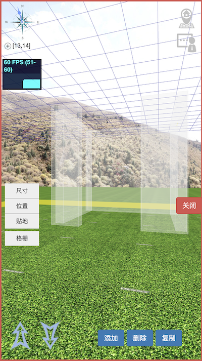

# VBW module notes

Module is a relatively independent program module, which is used to add, delete, modify and query the raw node data in block.


For example, the following node data, after being interpreted and executed by components, is displayed as a rectangular space, which can be accessed only from the opening.

```
{
	"wall":[
		[[4.3,0.2,3],[7.15,14.65,1.5],[0,0,0],2,[]],
		[[0.2,3,3],[9.15,13,1.5],[0,0,0],2,[]],
		[[0.2,3,3],[5.15,13,1.5],[0,0,0],2,[]],
		[[1,0.2,3],[8.65,11.35,1.5],[0,0,0],2,[]],
		[[1,0.2,3],[5.5,11.35,1.5],[0,0,0],2,[]]
	],
	"stop":[
		[[[0.3,3,4],[5.15,13,2],[0,0,0],1],
		[[4.3,0.3,4],[7.15,14.65,2],[0,0,0],1],
		[[0.3,3,4],[9.15,13,2],	[0,0,0],1],
		[[1,0.3,4],[5.5,11.35,2],[0,0,0],1],
		[[1.3,0.3,4],[8.65,11.35,2],[0,0,0],1]]
	],
}
```

[Demo(only mobile mode,coordinate[5,6])](http://vbw.qqpi.net/web/index.html#5_6_0) , [edit mode(user:admin,password:admin123456)](http://vbw.qqpi.net/admin/?mod=block&act=edit&x=5&y=6)

Rending like this:




## Purpose

* Open definition, data structure definition of components will be managed uniformly, open and transparent. In this way, it can be easily extended to multi platforms.

* Secure and trusted storage, using the blockchain capability given by substrate, stores the data of the entire 3D scene on the network. Different from simple numerical values, these data can form a 3D space that can be entered into the experience, form a logical series of games, and form a self consistent virtual 3D world. This makes the data itself have the value of breaking away from the real world and becoming a virtual asset in the real sense.

* Through different ways to build data, data can be displayed across the platform. At present, it can run well on PC platform and mobile platform. When VR / AR matures, it can be migrated to the past with low cost.

* Based on the exploration of the characteristics of blockchain, due to the time attribute of the blockchain, it is worth trying how to make the data and time be connected and finally reflected in the 3D environment.

  

## Construct

The module is verified and stored on the substrate side and verified, parsed and displayed on the Polkadot side.


Take the [stop](stop.md) module (the component used to stop the player's movement) as an example , the data are as follows forming a rectangular enclosure:

```
[
	[[[0.3,3,4],[5.15,13,2],[0,0,0],1],
	[[4.3,0.3,4],[7.15,14.65,2],[0,0,0],1],
	[[0.3,3,4],[9.15,13,2],	[0,0,0],1],
	[[1,0.3,4],[5.5,11.35,2],[0,0,0],1],
	[[1.3,0.3,4],[8.65,11.35,2],[0,0,0],1]]
]
```

Data on substrate like this:

```
{
raw:0x7b2273746f70223a5b5b5b5b302e332c332c345d2c5b352e31352c31332c325d2c5b302c302c305d2c315d2c5b5b342e332c302e332c345d2c5b372e31352c31342e36352c325d2c5b302c302c305d2c315d2c5b5b302e332c332c345d2c5b392e31352c31332c325d2c5b302c302c305d2c315d2c5b5b312c302e332c345d2c5b352e352c31312e33352c325d2c5b302c302c305d2c315d2c5b5b312e332c302e332c345d2c5b382e36352c31312e33352c325d2c5b302c302c305d2c315d5d5d7d,
	status: 		1,
	elevation: 	0,
	stamp: 			42,
	owner: 			14iFLQgsUyWfCug92ir5Bd4kZVNH5u9FCdbnRhbQEnGYWhZB,
	tenant: 		14iFLQgsUyWfCug92ir5Bd4kZVNH5u9FCdbnRhbQEnGYWhZB,
}
```

Because of stop module special function it only can be shown in edit mode,Rending on mobile like this:



Test the function by yourself. This Demo is not based on substrate now.

[stop module(only mobile mode,coordinate[13,14])](http://vbw.qqpi.net/web/index.html#13_14_0),[edit mode in admin panel(user:admin,password:admin123456)](http://vbw.qqpi.net/admin/?mod=block&act=edit&x=13&y=14)


## Types

Module is an important part of VBW, which can build a rich and colorful virtual world. The following can build a basic 3D environment.

* basic：[block](block.md)，[stop](stop.md)，[trigger](trigger.md)，[gift](gift.md)
* extended：[wall](wall.md)，[importer](importer.md)，[tree](tree.md)

