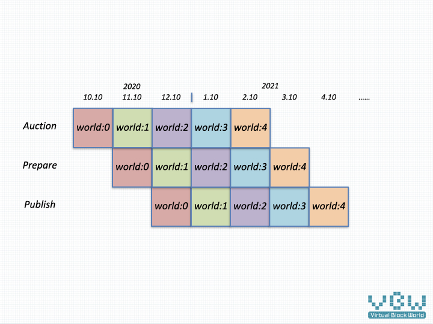

# VBW publish notes

VBW adopts the monthly release mode. The complete online process is 3 months, 1 month auction, 1 month prepare and 1 month publish. This is a release mode that is convenient for management. At the initial stage, personnel intervention is required. After the system is mature and stable, it can be foreseen that full automation can be realized. This is very blockchain and a decentralized management mode.

## Issue Process

### Aution

The new VBW world is issued monthly by auction and paid by DOT. The higher price will be obtained. DOT revenue will be transferred to the account designated by the Governance Committee to support the operation of the entire VBW.

### Prepare

After the auction, the basic configuration of the new VBW world will be written to the chain, and set the owner of all blocks as the  King. King shapes the development direction of the world by configuring world parameters, which mainly regulate the following aspects of the world. 

With the development of VBW, the specific configuration content will increase or limit, which will be managed by the Governance Committee. The configuration include different aspects.

* Proportion of various expenses.
* Modules for new VBW world.
* Configuration of operation measures.

On the other hand, the operation of the world relies on King's intelligence to create an interesting and novel world, so as to attract players, let the world's land appreciate, and more players contribute interesting content.

### Publish

After the VBW prepare phase is over, it is officially open to players. This time end is used for the implementation of various marketing measures, such as air drop of VBC in the new world and completion of various tasks in the new world.

## Issue Plan

World 0 of VBW will be directly handed over to the founder as a reward and as a test environment for trial operation. VBW will be launched in January 2021.

